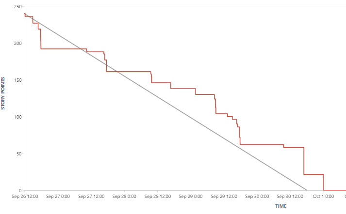
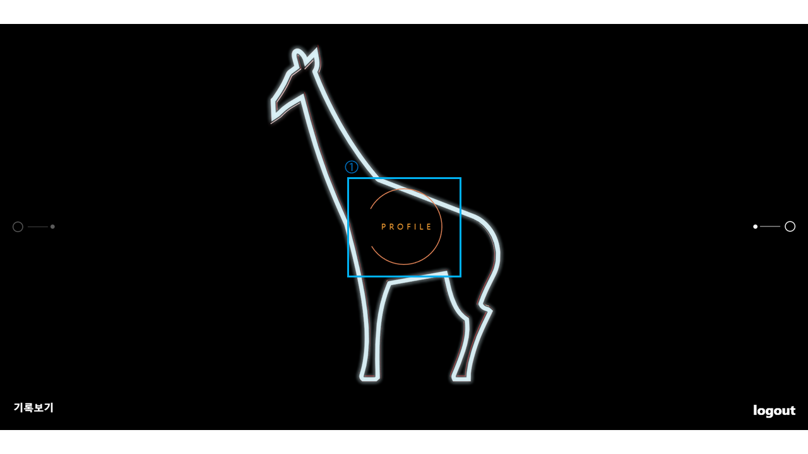

# GIRINEE🦒 - 특화프로젝트(A-202)


[TOC]

---

## 1. 서비스 개요🎸

> ### GIRINEE

### 기능

#### 기타 코드연주 학습 프로그램, 'GIRINEE'는 기타를 처음 배우거나 다음 단계로 나아가기 힘든 입문자들을 위해 개발되었습니다.

**기린이(이하 '기리니')는 다음과 같은 기능을 제공합니다.** 

1. 기리니는 유저들에게 **'코드 연습 기능'**을 제공합니다.
   - **쉬운 난이도(EASY LEVEL)** 에서는 7가지 기본 코드와 해당 코드들의 마이너 코드를 포함한 총 14개의 코드 중 하나를 선택하여 연습할 수 있습니다.
   - **중간 난이도(NORMAL LEVEL)**와 **어려운 난이도(HARD LEVEL)**에서는 쉬운 난이도에서 연습한 코드 중 4개의 코드로 이뤄진 하나의 코드 세트를 시간 내에 연주하는 게임 형태의 연습을 진행할 수 있습니다.
2. 기리니는 유저들에게 해당 유저의**'기록 조회 및 통계'**기능을 제공합니다.
   - 유저들은 각자의 프로필 페이지에서 본인의 연습 혹은 게임 결과를 그래프로 확인할 수 있습니다.
     - 쉬운 난이도에 대해서 **각 코드별 정확도**를 보여줍니다.
     - 중난 난이도와 어려운 난이도에 대해서 **최근 7개의 게임 기록을 그래프**로 나타내 줍니다.
3. 기리니에서는 **'각 코드의 운지표 정보'**를 미리 찾아볼 수 있습니다.


> ### 서비스명 / 로고 / 아이덴티티 컬러

### 서비스명

- #### GIRINEE 

  **'기타'와 초급자를 뜻하는 '어린이'의 합성어**인 '기린이'를 소리나는 대로 표현하여, **기타 입문자 혹은 초보자를 위한 서비스**임을 표현합니다.


### 로고

- #### 메인로고

  - '기린이'라는 서비스명과 동음을 가진 동물 '기린'에 유저를 빗대어 기린모양의 일러스트를 사용하였습니다.

    

  

- #### 텍스트로고

  - 'GIRINEE' 단어를 서비스의 UI 디자인과 컨셉에 최대한 맞는 폰트를 사용해 사용하였습니다.

  

- #### 파비콘로고

  

### 아이덴티티 컬러🎨

- #### ⚫**Black and Silver**⚪

  - 전체적인 UI가 **기타 앰프에서 따온 형태**를 띠고 있어 서비스의 아이덴티티 색상도 기타의 앰프에서 따온 **'검은색'**과 '**은색**'으로 하였습니다.


---

## 2. 팀원 소개 및 역할 😎

### 팀장 : 남성은 (Frontend)

- Git 형상관리
- 컴포넌트 디자인 (기타 연습 / 게임 기능 구현)
- 강화학습을 위한 데이터 셋 추가 제작

### 팀원 : 오채명 (Frontend)

- JIRA / Notion / PPT / UCC 제작

- 컴포넌트 디자인 (기록 확인 / 소셜 로그인 구현)
- 강화학습을 위한 데이터 셋 추가 제작

### 팀원 : 원민석 (Frontend)

- 와이어 프레임 
- UI / UX
- three.js 사용하여 메인페이지 및 여러 인터랙션 요소 제작

### 팀원 : 윤성도 (Backend)

- Java (Springboot)
- API 구축
- CI / CD
- 서버 배포
- ERD 제작

### 팀원 : 이용우 (Backend)

- Python (Tenserflow)
- 인공지능 모델링 / 모델 강화
- 포팅매뉴얼 제작

### 팀원 : 이임충 (Backend)

- Python (Tenserflow)
- 인공지능 모델링 / 모델 강화
- PPT 제작


---

## 3. 기획과 구상💡

### 기획의도

- **기타를 처음치는 사람 혹은 독학하는 사람들이 가장 어려운 부분은, 다음과 같이 크게 세가지!**
  1. 기타의 각 코드를 정확히 운지하지 못하는 경우
  2. 손에 힘이 없어 운지를 제대로 하였지만 소리가 나지 않는 경우.
  3. 각 코드는 운지할 수 있지만, 정해진 시간내에 다른 코드로 손을 옮겨야 하는 경우

- **음원파일 인식과 분류모델을 통해 연주자가 해당 코드를 제대로 쳤는지 혹은 시간 내에 운지를 다르게 하였는지를 파악하고 피드백을 주는 서비스 기획**


### ERD

#### - [ERDCloud](https://www.erdcloud.com/d/5T9ACBHi2Xyeska42)


### 와이어프레임

#### - [Figma](https://www.figma.com/file/Pcgh0OiAFDwuTpME69k7j4/Untitled?node-id=0%3A1)


### 파일구조

#### - 백엔드 (JAVA)

```
Backend
  ├── .gradle
  ├── .idea
  ├── grable/wrapper
  ├── src
  |    ├── main
  |    |     ├── java/com/a202/girinee
  |    |     |     ├── common
  |    |     |     ├── config
  |    |     |     ├── controller
  |    |     |     ├── dto/response
  |    |     |     ├── entity
  |    |     |     ├── exception
  |    |     |     ├── repository
  |    |     |     ├── security
  |    |     |     ├── service
  |    |     |     ├── util
  |    |     |     └── GirineeApplication.java
  |    |     └── resources
  |    |           ├── static
  |    |           └── application.properties
  |    └── test/java/com/a202/girinee
  |          └── GirineeApplicationTests.java
  ├── Dockerfile
  ├── bulid.gradle
  ├── gradlew
  ├── gradelw.bat
  └── settings.gradle
```

#### - 백엔드 (Python)

```
Backend-python
  ├── Dockerfile
  ├── main.py
  ├── models.py
  ├── sample_request.py
  └── requirements.txt
```

#### - 프론트엔드

```
Frontend
  ├── conf/conf.d
  ├── node_modules
  ├── public
  ├── src
  |     ├── @types
  |     ├── app
  |     ├── assets
  |     |     ├── 3d
  |     |     ├── chord_sounds
  |     |     ├── fonts
  |     |     └── images
  |     ├── component
  |     |     ├── chordtable
  |     |     ├── game
  |     |     ├── mainpage
  |     |     └── myRecord
  |     ├── features
  |     |     ├── chordgamae
  |     |     ├── chordthree
  |     |     ├── rotatingbtn
  |     |     ├── login
  |     |     ├── mainpage
  |     |     └── myrecord
  |     ├── routes
  |     |     ├── ChordGame.tsx / ChordGame.css
  |     |     ├── ChordTable.tsx / ChordTable.css
  |     |     ├── KakaoLogin.tsx / KakaoLogin.css
  |     |     ├── MainPage.tsx / MainPage.css
  |     |     └── MyRecord.tsx / MyRecord.css
  |     ├── utils
  |     ├── widgets
  |     |     ├── Controller.tsx / Controller.css
  |     |     ├── MainBtn.tsx / MainBtn.css
  |     |     ├── Navbar.tsx / Navbar.css
  |     |     ├── RotatingBtn.tsx / RatatingBtn.css
  |     |     └── Spinner.tsx / Spinner.css
  |     └── Auth.js
  ├── .gitignore
  ├── Dockerfile
  ├── README.md
  ├── package-lock.json
  ├── package.json
  └── tsconfig.json
```


---

## 4. 기술 스택 및 협업 툴⚙

### 기술 스택💻

- #### Backend - JAVA / Python

  - **Intellj IDE**
  - **vscode**
  - **java 11**
  - **python**
  - **SpringBoot 2.7.1**
  - **Spring security** / **Srping validation** / **Spring Web**
  - **Keras**
  - **mysql 8.0.30**
  - **Oauth 2.0**
  - **JWT 0.11.5**
  - **Teachable Machie**
  - **TensorFlow**
  - **librosa**


- #### Frontend - React

  - **vscode**
  - **React**

  - **ReactRouter**

  - **Redux**

  - **MUI**

  - **MediaRecorder**

  - **Three.js**

  - **Html / CSS**

  - **TypeScript**

  - **ECMAScript**
  - **Axios**
  - **sweetalert2 5.0.5**


- #### CI / CD

  - **AWS EC2**
  - **Jenkins 2.346.3**
  - **Nginx**
  - **Docker 20.10.17**


---


### 협업 툴🛠

#### Git, [Gitlab](https://lab.ssafy.com/s07-ai-image-sub2/S07P22A202)

- ##### 컨벤션

  - Git Flow

    **메인 브렌치 - 항상 유지**

    - main(master) : 제출할 수 있는 브렌치
    - develop : 개발 브렌치

    **보조 브렌치**

    - frontend : 프론트엔드 기능을 merge하는 브렌치
    - backend : 백엔드 기능을 merge하는 브렌치
    - feature : 기능을 개발하는 브렌치 - 각각 frontend, backend 브렌치에 머지
      - 브렌치 이름은 feature-back-login 이런식?
    - release : develop 브렌치에 모두 merge 후 테스트하는 브렌치
    - hotfix : release에서 발생한 버그를 수정하는 브렌치

    **Git Commit Convention**

    기본적으로 커밋 메시지는 제목/본문/꼬리말로 구성한다

    ```bash
    type: subject
    
    body
    
    footer
    ```

    - type
      - feat : 새로운 기능 추가
      - fix : 버그 수정
      - docs : 문서 수정
      - style : 코드 포맷팅, 세미콜론 누락, 코드 변경이 없는 경우
      - refactor : 코드 리팩토링
      - test : 테스트 코드, 리팩토링 테스트 코드 추가
      - chore : 빌드 업무 수정, 패키지 매니저 수정
      - design : UI 디자인 변경 (css 등)
      - comment : 주석 추가 및 변경
      - rename : 파일명, 폴더명 수정 또는 이동
      - remove : 파일 삭제
      - setting : 프로젝트 세팅
    - Subject
      - 제목은 50자 이하로. 첫글자는 대문자로 작성. 특수문자(마침표) 붙이지 않기
      - 동사 원형으로 시작
      - 과거시제 사용x
      - 명령어로 작성
      - ex) Added —> Add
    - Body
      - 선택사항. 모든 커밋에 작성할 필요 없음
      - 부연설명이 필요하거나 커밋의 이유를 설명할 경우 작성
      - 72자 이하. 제목과 구분되기 위해 한칸을 띄워 작성
    - footer
      - 선택사항. 모든 커밋에 꼬리말 작성할 필요 없음
      - issue tracker id를 작성할 때 사용

    ex)

    ```bash
    feat: 관심지역 알림 ON/OFF 기능 추가(#123)
    
    시군구의 알림을 각각 ON/OFF 할 수 있도록 기능을 추가함
     - opnion0055: 구분 코드
    
    해결: close #123
    ```

    - body와 footer는 선택사항이기 때문에 우리는 제목(type: subject)를 잘 작성하자
      - type: subject 에서 : 앞뒤로 띄어쓰기 주의


---

#### [Notion](https://www.notion.so/A202-c2676edcff594d3c946902b69a9d89a4)


---

#### [Jira](https://jira.ssafy.com/projects/S07P22A202/summary)

- **Burndown Chart** (우하향 그래프)




---

#### Webex

- 팀회의, 팀미팅
- 원격조정

#### MatterMost

- 팀 메시지
- 개인 DM

#### Discord

- 화면 공유 및 회의


---

## 5. 서비스 구성

### Sign up / Login

#### - 각 구성요소 살펴보기


1. 도메인 접속 후 중앙에 있는 **ENTER 버튼**을 클릭하면 **카카오 소셜로그인 페이지**로 이동합니다.
2. 해당 로그인 페이지에서 버튼을 눌러 **로그인 (최초로그인 시 회원가입)**하세요.


---

### MainPage

#### - 각 구성요소 살펴보기



1. 로그인을 하면 처음 본 **메인페이지로 리다이렉트** 됩니다. 이 때, 가운데 로고에 네온이 켜지고, **PROFILE 버튼**이 활성화됩니다.


1. **Enter 버튼을 눌러 해당 페이지로 이동가능합니다.**
2. **버튼을 눌러 다른 메뉴로 이동합니다.**


- 각 메뉴에 있는 앰프는 돌리면서 세세히 볼 수 있습니다.


---

### ChordGame

#### - 각 구성요소 살펴보기


1. **네비게이션바**
   - 좌측에는 서비스 로고가 있습니다.
   - 우측에는 나의 기록을 볼 수 있는 프로필 페이지와 로그아웃을 할 수 있는 메뉴 버튼이 있습니다.
2. **각 레벨에 대한 정보와 코드정보**
   - 각 레벨의 이름과 레벨에서 할 수 있는 연습 또는 게임에 대한 설명이 상단에 위치합니다.
   - 하단에는 각 레벨별로 사용자의 연습 또는 게임을 도와주는 정보가 있습니다.
3. **Three.js 를 사용해 만든 각 코드의 이름**
   - 커다란 코드의 이름을 띄워줌으로써 사용자가 바로바로 현재 코드를 인식할 수 있도록 가독성을 높였습니다.
4. **메인 컨트롤러**
   - 상단부터 차례대로 메뉴로 돌아가는 버튼입니다.
   - 노브 두 개는 각각 레벨을 정해주는 노브와 `3`의 색상을 정해주는 노브입니다.
   - 우측의 슬라이더는 각 코드에 할당되는 시간(초단위)를 정하는 것으로 연습모드에서는 비활성화 되며 게임모드에서 활성화됩니다.
5. **각 레벨의 컨트롤러**
   - 각 레벨마다 다르게 생긴 컨트롤러입니다.


#### 각 레벨의 UI

##### [ LOW LEVEL ]


##### [ NORMAL LEVEL ]


##### [ HARD LEVEL ]


#### 연습 진행 결과

##### [ LOW LEVEL ]


##### [ NORMAL LEVEL / HARD LEVEL ]


---

### Profile (My Record)

#### - 연습모드와 게임모드를 나누어 볼 수 있는 페이지입니다.

- ##### 연습모드에 대해서 각 코드의 시도횟수 / 맞은횟수 / 틀린횟수 를 그래프로 확인할 수 있습니다.

- ##### 게임모드에 대해서 최근 7개 게임의 결과를 확인할 수 있습니다.

##### 

#### [ 코드 연습 결과 기록 ]


#### [ 코드 게임 결과 기록 ]


---

### Chord Table

#### - 연습모드에서 제공하는 모든 코드의 운지표를 미리 확인하고 볼 수 있는 페이지입니다.


